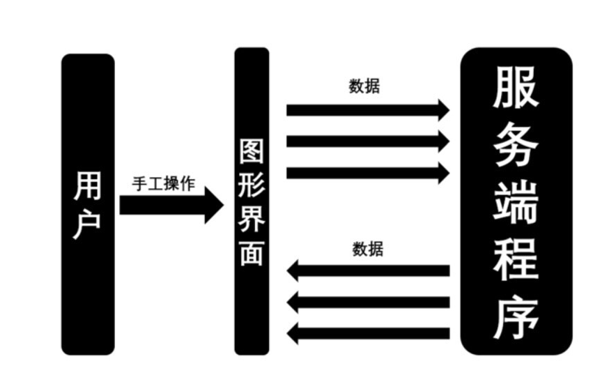
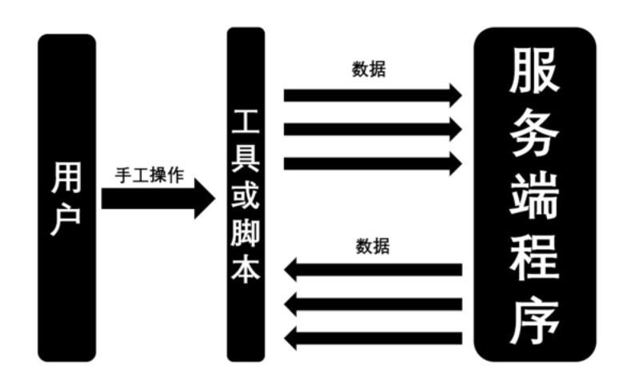
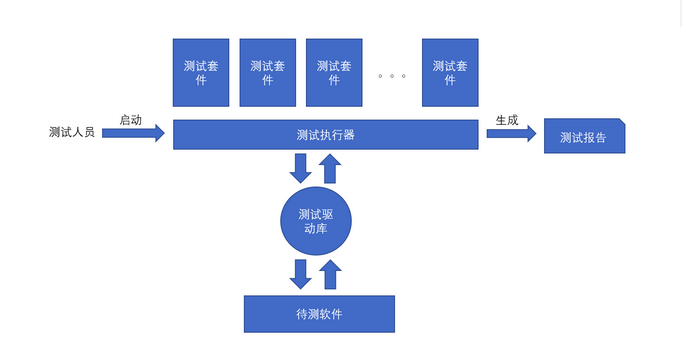
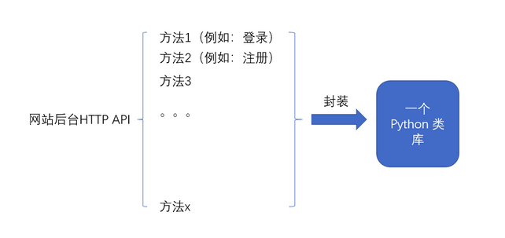
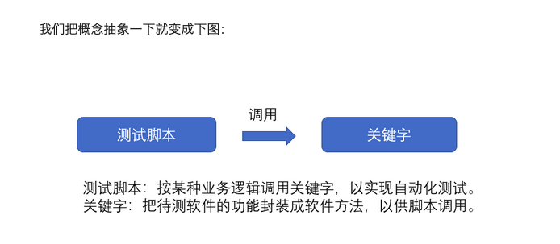

## 1、认识接口测试
### #传统的手工测试



### #接口测试


对比发现两者之间唯一的不同，就是把手工测试操作界面更换成了接口测试的工具或者脚本。
也就是说，我们做普通手工测试的大部分测试方法，在接口测试中仍然试用。

----
### #分析一下图中东西的含义

1》服务端程序
现在的软件开发大多是网络程序的开发。网络程序又通常分为服务器程序与客户端程序。
像我们常常使用的搜索引擎，我们用的浏览器或手机APP打开搜索引擎，这个浏览器或者手机
APP也就是客户端。当我们在客户端输入一个搜索关键字时，这个信息会被发送到服务端程序上。
然后服务端程序去做信息的检索，再把搜索结果返回到客户端程序，这样我们就可以看到搜索
结果。
**接口测试的目标通常就是测试服务端程序。**

2》图形界面
指客户端提供给客户使用的界面。**标准叫法叫用户接口(UI,User Interface)和图形化用户接口（GUI,Graphical User Interface）。**区别是UI泛指各种给用户
提供的界面，比如Linux操作系统中的命令行界面也是一种UI，而GUI指图形化界面。

3》数据
当我们操作UI时，客户端程序会把我们想发送给服务端的指令封装成数据的包。当服务端把数据处理完毕或指令执行完毕后，服务端会把要给用户看的数据也封装成包，发送给客户端。客户端再把包解开，给用户看里面的数据。**称为封包和解包**

4》工具或脚本
当我们使用图形界面做手工测试时，可以不使用工具或脚本，客户端程序会完成数据的封包。这样做测试，测试的对象是整个程序。也就是说，我们把 **客户端程序加上服务端程序视为一个黑盒。**而接口测试中则不同，我们测试的对象变成了服务端程序。也就是说，我们把 **服务端程序视为一个黑盒。**然后，再 **用工具或脚本去模拟客户端程序的操作。**像客户端程序一样去做封包工作和数据发送工作，再在收到服务端返回信息后，像客户端程序一样把包解开。把数据呈现出来。这种用代码去 **模拟**某部分测试工作的做法，我们通常称为**MOCK**

## 2、接口测试框架设计
### #一个简单的测试框架组成



1. 测试套件：测试用例的集合
2. 测试驱动库:selenium, requests等

首先测试人员启动了测试执行器，测试执行器调用了测试套件（测试套件指测试用例的集合），然后按照测试用例中描述的业务逻辑，使用测试驱动库（如selenium，requests等）去操作待测软件，并从待测软件中收集业务逻辑的执行结果。将结果汇总之后，生成测试报告。

这就是一个最简单的测试框架的设计思路。我们把测试驱动库，测试执行器以及测试套件们看做一个整体，称为测试框架。要设计一个测试框架，就要对这些组件分别进行需求分析和选型。需求分析指的是我们把我们想要在这个程序里包含的功能点罗列出来。选型则是根据这些需求，选择我们实现这些需求的方法，这些方法可能是自己写代码实现，也可能是使用第三方库实现。
下面分别对各个组件进行需求分析和选型：

1.测试执行器
需求分析：

1. 可以调用测试用例，并汇总成报告。
2. 对失败的测试用例，可以给出失败的原因。
3. 对单个测试用例，可以有前置操作或后置操作，也就是支持俗称的 setup和 teardown。
4. 可以按照需要执行选定的部分测试用例，比如，执行所有属于冒烟测试的测试用例。
5. 安装简单。
选型：pytest
<https://docs.pytest.org/en/latest/>

2.测试驱动库
需求分析：

1.能发 HTTP 协议的接口请求
选型：requests

3.测试数据管理

选型：前期测试数据将保存在文本文件里。

4.测试报告

需求分析：

1.要打出 xml 报告和 html 报告

2.xml 报告应该和 junit 兼容

选型：pytest-html

综上，这个接口测试框架将基于 python+requests+pytest 来实现。

### 3、框架设计理念
可以借鉴python 的 robot framework 测试框架的设计理念：关键字 和 脚本。


一个网站的后台 HTTP 接口可能包括了很多很多方法，第一步，我们把它封装成一个python类库。我们曾经使用很多Python的标准库和一些第三方库。我们设计一个接口测试框架的时候，目的是能调用这个网站提供的HTTP接口，那么怎样调用呢？自然而然地，我们就想到，可以把这些HTTP接口封装成普通的Python库啊。

这也是软件测试开发中的第一大核心方法：**封装**

将项目中用的API封装成PYTHON类库，封装完成后，可以以类名加方法名的形式调用HTTP接口
例1，一个测试用例伪代码

---
```
def test_create_repo_and_upload_file():
mecury = Mecury(xxx).login(username=xxx,password=xxx)
repo = mecury.create_repo(xxx)
result = repo.upload_file(xxx)
assert result.success=True,xxxx
```
---
多个测试用例的集合我们称之为脚本


## 4、代码的下载
问题：怎么把一个Git仓库的代码下载到本地?

1. 登录github获取仓库拷贝地址:<https://github.com/Gunnine/Pintuan>
2. 打开终端使用以下命令下载所有代码
 
  1》cd一个下载目录
 
  2》git clone XXX.git 代码会被下载到当前目录
 
  3》cd近代码文件 输入ls 查看拷贝代码中的文件
  
  4》发现只有一个文件，为什么呢?
 因为默认使用的是master分支，而master分支

 里我没放代码。 此时，需要用 git checkout 命令来转入指定分支。

 5》git branch 查看当前分支

    git branch -a 查看所有分支

    git checkout xx 转入分支

 6》可以用pycharm查看项目代码

## 5、工具类 RestClient 请求客户端
问题1：那么为什么写这个类？
>假如我们不用这个类,收发请求一般是requests来做。

例1：reuqests收发请求的示例：

----
```
response = requests.post("http://csp.nhsoft.cn/post",data={"a":"b"})
print(reponse.text)
```
----

但是这样的请求之间没有关联，当我们需要一些连续请求时，比如“先登录再把商品加入购物车“，这时，需要使用 requests 的 session 功能。伪代码示例如下:

例2：requests session 收发请求的伪代码示例：

----
```
session = requests.session()
```
### #登录伪代码
```
response = session.post("http://csp.nhsoft.cn/login",
data={"username":"aaa","password":"bbb"})
print(response.text)
```
----
### #将一个商品加入购物车伪代码
```
response = session.post("http://csp.nhsoft.cn/cart"，data={"aaa":"b"})
print(response.text)
```
### #分析
例2的两个请求都由同一个requests session对象发出，两个请求带了同一个header信息
与cookie,所以可以完成先登录再购物的操作

### #思考
除了公用session还有什么地方可以优化?
>不足：按照例2的写法需要每个请求都写一遍完整的url

>改进:我们可以建一个类自动给所有url加上前缀

例3：增加了代码前缀功能的RestClient类
```
import requests,json
class RestClient():
    def __init__(self,api_root_url):
        self.api_root_url=api_root_url
        self.session = requests.session()

    def get(self,url, **kwargs):
        return self.request(url,"get",**kwargs)

    def post(self,url,data=None,json=None,**kwargs):
        return self.request(url, "post",data,json,**kwargs)

    def options(self, url, **kwargs):
        return self.request(url, "potions", **kwargs)

    def head(self, url, **kwargs):
        return self.request(url, "head", **kwargs)

    def put(self, url, data=None, **kwargs):
        return self.request(url, "put", data,**kwargs)

    def patch(self, url, data=None, **kwargs):
        return self.request(url, "patch", data,**kwargs)

    def delete(self, url, **kwargs):
        return self.request(url, "delete", **kwargs)

    def request(self,url,method_name,data=None,json=None,**kwargs):
        url = self.api_root_url+url
        if method_name == "get":
            return self.session.get(url, **kwargs)
        if method_name == "post":
            return self.session.post(url, data, json, **kwargs)
        if method_name == "options":
            return self.session.options(url, **kwargs)
        if method_name == "head":
            return self.session.head(self, url, **kwargs)
        if method_name == "put":
            return self.session.put(self, url, data, **kwargs)
        if method_name == "patch":
            return self.session.patch(self, url, data, **kwargs)
        if method_name == "delete":
            return self.session.delete(self, url, **kwargs)
```


1. init方法：初始化这个类，初始化的时候需要输入api_root_url，也就是URL的前缀。
另外还在初始化时创建了self.session用于保存requests的session。

2. get,post等各种http方法，用于让用户使用。但这里并没有真正实现这些方法，
因为这些方法都是在requests里有实现过，我们只要把参数传给requests就行了。
这个传递我们写在request方法里，所以这里的http方法都是调用requests方法。

3. request方法:真正调用self.session的各种方法，这里同样是把参数传下去，
只是在传之前，给所有用户输入的url加了一个前缀。前缀的值是用户在init方法输入的。

例4：运行例3的类代码

----
```
r=RestClient("http://csp.nhsoft.cn")
x= r.post("/post",json= {"a":"b"})
print(x.text)
```
----

## 6、代码的提交
  1》cd 进项目
  
  2》git status 查看项目状态
  
  3》git add xx
  
  4》git commit -m "提交备注"
  
  5》git push

## 7、代码更新
 1》git fetch 可拉取新分支
 
 2》git pull 更新

